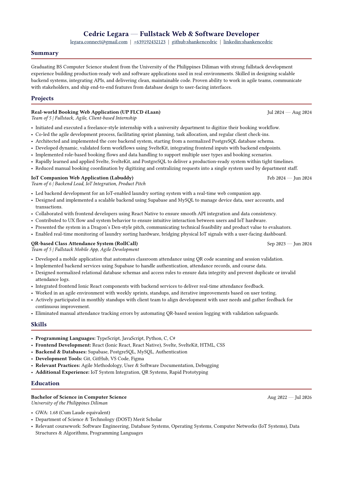

## Resume Preview
> Click on this preview to fully view the resume PDF.

## Usage
To compile, run `typst compile main.typ Legara_Web-Software-Developer-Resume.<file-extension>` with the typst CLI installed and on path. 
> VS Code tip: there is the [Tinymist Typst extension](https://marketplace.visualstudio.com/items?itemName=myriad-dreamin.tinymist) which enables you to preview your work realtime--although a bit laggy on my device.