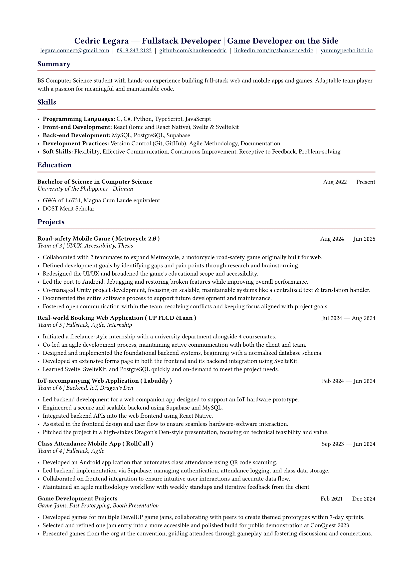

## Preview

Click on this preview to view the PDF.

## Usage
To compile, run `typst compile main.typ main.pdf` with the typst CLI installed and on path. 
> VS Code tip: there is the [Tinymist Typst extension](https://marketplace.visualstudio.com/items?itemName=myriad-dreamin.tinymist) which enables you to preview your work realtime--although a bit laggy on my device.

## Template
The typst template used is [kiresume](https://typst.app/universe/package/kiresume).